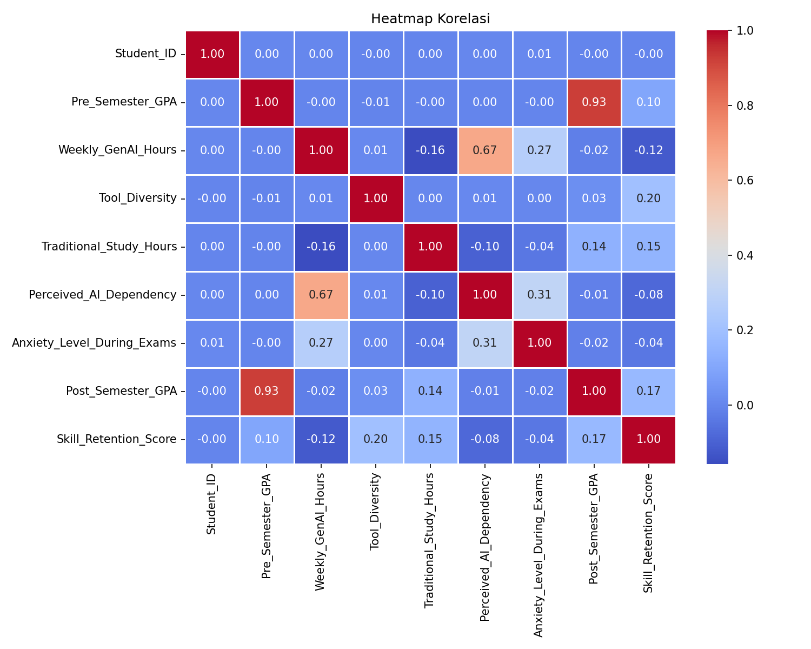
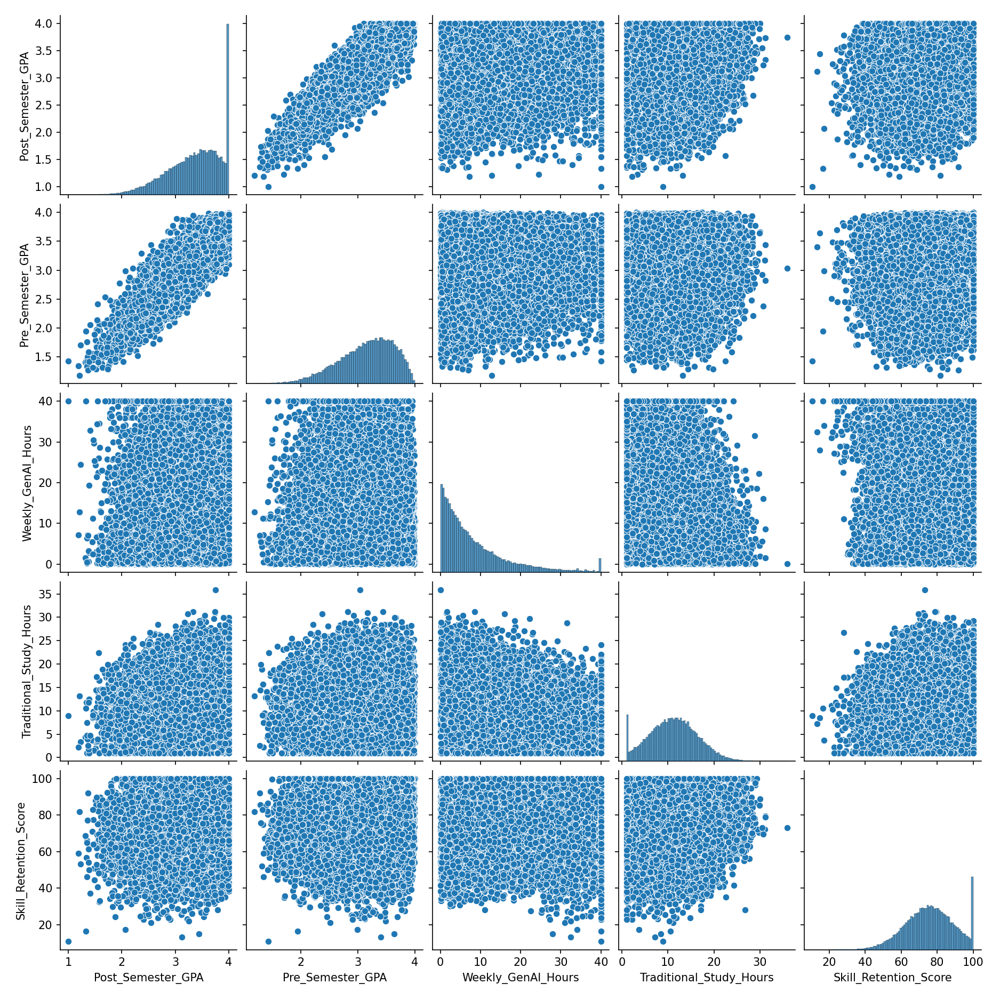
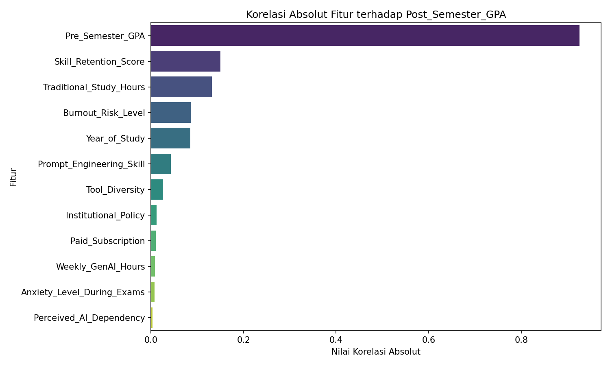
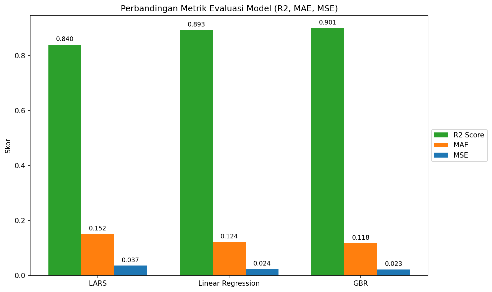

# Laporan Proyek Machine Learning - Prediksi Dampak AI terhadap Performa Akademik

## Project Overview

Pada era ini, penggunaan *Generative AI* (Gen AI) sangat masif digunakan di berbagai bidang, mulai dari sektor industri, pendidikan, bisnis, hingga personal. Hal ini terjadi berkat kemajuan teknologi yang pesat sehingga penggunaannya semakin mudah diakses. Kemudahan penggunaan serta manfaat yang diberikan membuat Gen AI sangat diminati oleh banyak kalangan. Penggunaan AI dan teknologi interaktif lainnya memperkaya pengalaman belajar siswa, menjadikannya lebih menarik dan efisien, serta membantu pendidik dalam mengurangi beban kerja evaluasi otomatis [1]. 

Namun, di balik kemudahan tersebut, terdapat risiko penyalahgunaan Gen AI. Salah satu risiko yang paling mengkhawatirkan adalah menurunnya kualitas pendidikan akibat penggunaan AI yang tidak bertanggung jawab, yang dapat memicu penurunan kualitas berpikir kritis akibat ketergantungan [2]. Oleh sebab itu, perlu dilakukan penelitian mengenai hubungan dan dampak penggunaan AI terhadap performa belajar mahasiswa (Indeks Prestasi Kumulatif/GPA). Penelitian ini menggunakan pendekatan Machine Learning (Regresi) untuk memprediksi capaian akhir akademik mahasiswa berdasarkan faktor-faktor seperti keterampilan *prompt engineering*, kebijakan institusi, hingga risiko *burnout*. Proyek ini diharapkan dapat memberikan wawasan empiris bagi pendidik dan institusi dalam merumuskan regulasi penggunaan AI.

**Referensi:**
[1] S. Rifky, "Dampak Penggunaan Artificial Intelligence Bagi Pendidikan Tinggi," Indonesian Journal of Multidisciplinary on Social and Technology, vol. 2, no. 1, pp. 37-42, 2024, doi: 10.31004/ijmst.v2i1.287.
[2] H. I. Untu, S. Fahrudin, dan R. Effendi, "Dampak Penggunaan Artificial Intelligence (AI) Bagi Siswa Sekolah Dasar dalam Menyesuaikan Materi Pembelajaran," Jurnal Review Pendidikan dan Pengajaran, vol. 8, no. 2, pp. 4951-4956, 2025.

## Business Understanding

### Problem Statements
Berdasarkan latar belakang di atas, pernyataan masalah yang akan diselesaikan pada proyek ini adalah:
- Bagaimana memprediksi capaian akademik mahasiswa (*Post_Semester_GPA*) berdasarkan pola penggunaan kecerdasan buatan (AI)?
- Algoritma *machine learning* manakah yang memiliki tingkat akurasi paling baik untuk memodelkan hubungan antara fitur-fitur terkait AI dengan performa belajar?

### Goals
Tujuan yang ingin dicapai dari proyek ini adalah:
- Membangun model regresi *machine learning* yang mampu memprediksi *Post_Semester_GPA* dengan tingkat *error* yang paling minim.
- Membandingkan berbagai algoritma regresi dan mengevaluasi keandalannya.

### Solution statements
Untuk menyelesaikan masalah dan mencapai *goals* yang diinginkan, pendekatan yang diajukan adalah:
1. Melakukan tahapan *Data Preparation* yang terstruktur, meliputi pembersihan data, identifikasi dan penghapusan *outliers*, rekayasa fitur numerik dan kategorikal, hingga pembagian dataset.
2. Mengembangkan dan mengevaluasi tiga model *machine learning* yang berbeda:
   - **Least Angle Regression (LARS)**
   - **Linear Regression**
   - **Gradient Boosting Regressor (GBR)**

## Data Understanding

Data yang digunakan dalam proyek ini adalah *dataset* **ai_impact.csv** yang memuat informasi terkait mahasiswa, kebiasaan penggunaan AI, hingga pencapaian akhir akademik mereka. Dataset ini memiliki gabungan variabel numerik dan kategorikal.

Keseluruhan variabel (atribut) pada dataset ini adalah sebagai berikut:
- **Student_ID**: Identifier unik untuk mengidentifikasi setiap mahasiswa (tidak memiliki nilai prediksi sehingga dihapus pada tahap pemrosesan).
- **Major_Category**: Kategori disiplin keilmuan atau jurusan mahasiswa (contoh: STEM, Humanities, dsb).
- **Year_of_Study**: Tingkat tahun studi mahasiswa (*Freshman*, *Sophomore*, *Junior*, *Senior*, *Graduate*).
- **Pre_Semester_GPA**: Indeks Prestasi Kumulatif mahasiswa sebelum semester berjalan (GPA awal).
- **Weekly_GenAI_Hours**: Jumlah jam dalam seminggu yang dihabiskan mahasiswa untuk menggunakan *Generative AI*.
- **Primary_Use_Case**: Tujuan atau penggunaan utama AI oleh mahasiswa (misal: *Research*, *Writing*, *Coding*).
- **Prompt_Engineering_Skill**: Tingkat kemahiran dalam memberikan instruksi pada AI (*Beginner*, *Intermediate*, *Advanced*).
- **Tool_Diversity**: Tingkat keberagaman pemakaian alat/platform AI oleh mahasiswa (seberapa banyak platform berbeda yang dipakai).
- **Paid_Subscription**: Status kepemilikan langganan AI berbayar (misal ChatGPT Plus, Claude Pro).
- **Traditional_Study_Hours**: Jumlah jam belajar mandiri (tradisional) dalam seminggu tanpa intervensi AI.
- **Perceived_AI_Dependency**: Persepsi atau tingkat ketergantungan psikologis mahasiswa terhadap AI.
- **Institutional_Policy**: Kebijakan resmi kampus terkait penggunaan AI (*Strict_Ban*, *Allowed_With_Citation*, *Actively_Encouraged*).
- **Anxiety_Level_During_Exams**: Tingkat kecemasan mahasiswa ketika menghadapi ujian akademik.
- **Skill_Retention_Score**: Skor yang mengukur daya ingat dan retensi keterampilan serta pemahaman konsep mahasiswa.
- **Burnout_Risk_Level**: Tingkat risiko kelelahan fisik, emosional, dan mental secara ekstrem atau *burnout* (*Low*, *Medium*, *High*).
- **Post_Semester_GPA**: (Variabel Target) Indeks Prestasi Kumulatif (GPA) aktual yang diraih mahasiswa di akhir semester berjalan.

**Exploratory Data Analysis (EDA):**
Pada tahap EDA, dieksplorasi hubungan antar-fitur.
- **Matriks Korelasi (Heatmap)** dan **Pairplot** digunakan untuk mendeteksi multikolinearitas antar fitur numerik dan melihat tren korelasinya terhadap fitur target (*Post_Semester_GPA*).

Berikut adalah representasi visual dari **Heatmap Korelasi** dan **Pairplot** berdasarkan dataset eksperimen:

**Heatmap Korelasi:**

**Pairplot (Sebagian fitur utama):**

**Korelasi Fitur terhadap Target (Post_Semester_GPA):**
Visualisasi berikut mengurutkan fitur-fitur berdasarkan pengaruh atau korelasi absolutnya terhadap nilai GPA mahasiswa:

## Data Preparation

Tahapan data preparation yang dilakukan dalam eksperimen adalah:

1. **Seleksi Fitur Awal (Feature Selection)**: 
   - Menghapus kolom yang tidak relevan dengan prediksi performa (seperti `Student_ID`) dan beberapa kolom kategorikal kompleks (`Major_Category` dan `Primary_Use_Case`) untuk memfokuskan model pada analisis faktor teknis.
2. **Penanganan Outliers**:
   - Memvisualisasikan *boxplot* untuk mendeteksi nilai-nilai ekstrem.
   - Menggunakan metode *Interquartile Range* (IQR) untuk mendeteksi dan menghapus pencilan sehingga distribusi data menjadi lebih representatif dan model linear tidak terdistorsi.
3. **Pembagian Dataset (Train-Test Split)**:
   - Membagi data menggunakan `train_test_split` dengan rasio 80% data latih (Training) dan 20% data uji (Testing). Hal ini bertujuan untuk menguji model pada data yang belum pernah dilihat sebelumnya.
4. **Standarisasi (Standardization)**:
   - Menggunakan `StandardScaler` pada fitur numerik untuk menyamakan unit/skala data ke distribusi normal baku ($\mu=0, \sigma=1$).
5. **Encoding Kategorikal**:
   - Menggunakan `OrdinalEncoder` untuk mengonversi data kategori yang memiliki struktur hierarki/bertingkat (seperti `Year_of_Study` dan `Prompt_Engineering_Skill`) menjadi nilai numerik berurutan agar dapat dipelajari oleh model *machine learning*.

## Modeling

Tahap pengembangan model difokuskan pada tiga algoritma regresi:

1. **LARS (Least Angle Regression)**
   - Algoritma regresi ini memprioritaskan efisiensi tinggi pada fitur-fitur yang paling berpengaruh.
   - **Kelebihan**: Cepat dan memiliki proses reduksi fitur bawaan jika variabel independennya banyak.
   - **Kekurangan**: Pada eksperimen ini dipaksa menggunakan batas `n_nonzero_coefs=1`, sehingga model mengalami *underfitting* yang parah (hanya melihat satu fitur paling dominan).
2. **Linear Regression**
   - Pendekatan parametrik standar yang menciptakan garis lurus (linear) untuk memodelkan hubungan variabel independen dan dependen.
   - **Kelebihan**: Sangat mudah diinterpretasikan, minim kompleksitas.
   - **Kekurangan**: Tidak dapat menguraikan hubungan non-linear yang kompleks di antara prediktor.
3. **Gradient Boosting Regressor (GBR)**
   - Algoritma *ensemble* berbasis pohon keputusan (*decision tree*) yang secara iteratif memperbaiki prediksi model sebelumnya (mengurangi *loss*).
   - **Kelebihan**: Sangat tangguh (*robust*) terhadap relasi variabel yang non-linear dan mampu meminimalisasi sisa ketidakakuratan secara efektif.
   - **Kekurangan**: Membutuhkan waktu komputasi yang lebih lambat dan berpotensi *overfitting* jika *hyperparameter* tidak disesuaikan dengan baik.

Pada proyek ini, **Gradient Boosting Regressor** diposisikan sebagai solusi yang terbaik (*Top-1*) karena dataset dampak AI diindikasi tidak sepenuhnya bergerak linear, sehingga membutuhkan kapabilitas pohon keputusan berantai milik GBR.

## Evaluation

Model dievaluasi menggunakan tiga metrik utama dari model regresi. 
- **MAE (Mean Absolute Error)**: Rata-rata selisih absolut antara nilai prediksi dan aslinya. Semakin kecil, semakin akurat.
- **MSE (Mean Squared Error)**: Rata-rata dari kuadrat selisih antara nilai prediksi dan aslinya. Metrik ini memberikan penalti sangat besar untuk prediksi yang meleset jauh.
- **R2 Score (Koefisien Determinasi)**: Seberapa baik variabel independen menjelaskan varians fitur target. Rentang ideal adalah mendekati nilai 1.

Hasil pengujian terhadap *Test Set*:

| Model | MAE | MSE | R2 Score |
| :--- | :---: | :---: | :---: |
| **LARS** | 0.152407 | 0.036522 | 0.840109 |
| **Linear Regression** | 0.123610 | 0.024377 | 0.893279 |
| **Gradient Boosting Regressor** | **0.117860** | **0.022553** | **0.901264** |

Untuk mempermudah perbandingan kinerja dari ketiga model, berikut adalah visualisasi metrik evaluasi dalam bentuk *Bar Chart*:

Berdasarkan nilai tersebut dan visualisasi di atas, model **Gradient Boosting Regressor (GBR)** adalah model terbaik yang berhasil diimplementasikan. Nilai **R2 sebesar 0.901** berarti model mampu memprediksi dan memetakan 90.1% informasi terkait pencapaian mahasiswa (*Post_Semester_GPA*) dengan sangat baik dibandingkan kedua metode regresi lainnya. Metrik *error* (MAE dan MSE) yang dimiliki oleh GBR juga yang paling rendah.

**---Ini adalah bagian akhir laporan---**
